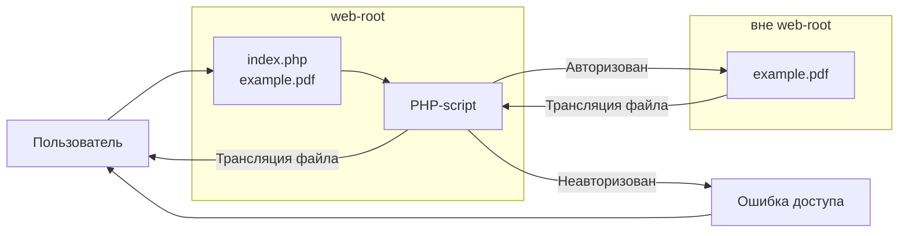

## 1. Описание проблемы

В системе управления контентом **1С-Битрикс** на страницах сайта размещаются ссылки на файлы
(PDF-документы, изображения и другие типы файлов).

Доступ к самим страницам корректно ограничен — они доступны только авторизованным пользователям.
Однако любой авторизованный пользователь может скопировать прямую ссылку на файл и передать её третьему лицу.
В этом случае файл остаётся доступным по прямому URL без какой-либо проверки прав доступа,
даже для неавторизованных пользователей.

Данная проблема возникает независимо от типа файла и способа его размещения:
- она затрагивает как файлы, загруженные напрямую в каталог `/upload`,
- так и файлы, прикреплённые к элементам инфоблоков или разделам, доступ к которым ограничен средствами Битрикса.

Таким образом, стандартный механизм разграничения прав доступа в Битриксе
не обеспечивает защиту файлов от прямого доступа по URL,
что приводит к утечке данных в закрытых сервисах.

## 2. Задача
Требуется реализовать механизм защиты файлов, при котором любые файлы
(документы, изображения и др.), размещённые в закрытой части сайта,
не могут быть получены по прямой ссылке,
даже при знании их физического расположения на сервере.

Доступ к файлам должен предоставляться исключительно
после серверной проверки авторизации и прав пользователя.

## 3. Решения
- [1. Описание проблемы](#1-описание-проблемы)
- [2. Задача](#2-задача)
- [3. Решения](#3-решения)
  - [3.1. Защищённая отдача файлов через сервер (PHP)](#31-защищённая-отдача-файлов-через-сервер-php)
  - [3.2. Nginx + X-Accel-Redirect](#32-nginx--x-accel-redirect)
    - [Сравнительная таблица](#сравнительная-таблица)
- [4. Термины](#4-термины)
  - [4.1. PHP-FPM](#41-php-fpm)
  - [4.2. X-Accel-Redirect](#42-x-accel-redirect)
   
###  3.1. Защищённая отдача файлов через сервер (PHP)

Метод заключается в том, что файлы хранятся **вне веб-рута**, то есть в каталоге, недоступном для прямого обращения по URL. Ссылки, размещённые на сайте, **не указывают на реальное физическое расположение файлов** на сервере.

При обращении пользователя к такой ссылке запрос направляется не к файлу напрямую, а к **PHP-скрипту**, расположенному в веб-руте. Данный скрипт выполняет проверку авторизации пользователя и, при необходимости, проверку прав доступа.

- Если пользователь **авторизован**, PHP-скрипт получает доступ к файлу по его реальному пути и **напрямую передаёт его содержимое** пользователю.
- Если пользователь **не авторизован**, файл не читается, и пользователю возвращается сообщение об отказе в доступе.

Таким образом, файл невозможно получить по прямой ссылке, даже при знании его физического расположения на сервере.

PS Вариант сработает, также если ограничить доступ к папке в web-root с помощью конфигурации nginx или apache
```nginx
location /upload/private/ {
    deny all;
}
```




Вариант реализации PHP-скрипта от GPT 5.2
```PHP
<?php
define("NO_KEEP_STATISTIC", true);
define("NO_AGENT_STATISTIC", true);
define("NOT_CHECK_PERMISSIONS", true);
require($_SERVER["DOCUMENT_ROOT"]."/bitrix/modules/main/include/prolog_before.php");

global $USER;

if (!$USER->IsAuthorized()) {
    \CHTTP::SetStatus("403 Forbidden");
    exit("Access denied");
}

$id = (int)($_GET['id'] ?? 0);
$path = "/home/bitrix/files/private/contract_{$id}.pdf"; // пример

if (!is_file($path)) {
    \CHTTP::SetStatus("404 Not Found");
    exit("Not found");
}

header('Content-Type: application/pdf');
header('Content-Disposition: attachment; filename="contract_'.$id.'.pdf"');
header('Content-Length: '.filesize($path));

readfile($path);
exit;
```

### 3.2. Nginx + X-Accel-Redirect

[Вопрос на хабр](https://qna.habr.com/q/578878)

Предыдущий метод может работать медленно, поскольку передача каждого файла осуществляется через PHP, что создаёт дополнительную нагрузку на [PHP-FPM](#41-php-fpm) и снижает производительность при работе с большими файлами. Эту проблему можно решить, передав ответственность за отдачу файлов веб-серверу Nginx.

Для этого используется специальный HTTP-заголовок [`X-Accel-Redirect`](#42-x-accel-redirect)— нестандартный механизм Nginx, предназначенный для внутреннего перенаправления запроса на файл. Суть метода заключается в том, что каталог с файлами объявляется внутренним (`internal`) на уровне конфигурации Nginx, поэтому прямой доступ к нему по URL невозможен. PHP-скрипт выполняет проверку авторизации и прав доступа пользователя и, в случае успешной проверки, возвращает заголовок [`X-Accel-Redirect`](#42-x-accel-redirect), указывающий Nginx, какой файл необходимо передать клиенту. Сам файл при этом читается и отдаётся напрямую Nginx, без участия PHP.

Таким образом, доступ к файлам по их фактическому расположению на сервере ограничен, а скорость передачи данных существенно выше по сравнению с вариантом, при котором файл читается и передаётся через PHP.

Настройка конфигурации nginx
```nginx
location /protected_internal/ {
    internal;
    alias /home/site/protected/docs/;
}
```
Вариант реализации PHP-скрипта от GPT 5.2
```PHP
<?php
require($_SERVER['DOCUMENT_ROOT'].'/bitrix/modules/main/include/prolog_before.php');

use Bitrix\Main\Context;

global $USER;

if (!$USER->IsAuthorized()) {
    http_response_code(403);
    exit;
}

// пример проверки прав
if (!\Bitrix\Main\Loader::includeModule('iblock')) {
    http_response_code(500);
    exit;
}

// допустим, получили путь из БД
$realPath = '/home/site/protected/docs/contract.pdf';

// базовая защита
if (!file_exists($realPath)) {
    http_response_code(404);
    exit;
}

// важно: путь ТОЛЬКО относительный к internal
$internalPath = '/internal_files/docs/contract.pdf';

header('Content-Type: application/pdf');
header('Content-Disposition: inline; filename="contract.pdf"');
header('X-Accel-Redirect: ' . $internalPath);
exit;
```
#### Сравнительная таблица

| Подход | Плюсы | Минусы |
|------|------|-------|
| **PHP-отдача файлов** | Простая реализация без настройки веб-сервера<br> работает на любом хостинге<br> полный контроль логики в PHP<br> легко интегрируется с бизнес-логикой 1С-Битрикс | Низкая производительность на больших файлах<br> высокая нагрузка на PHP-FPM<br> каждый файл занимает PHP-процесс на всё время передачи<br> плохо масштабируется при большом числе скачиваний |
| **Nginx + X-Accel-Redirect** | Высокая скорость передачи<br> минимальная нагрузка на PHP-FPM<br> надёжная защита от прямого доступа<br> хорошо масштабируется<br> поддержка больших файлов и Range-запросов<br> production-решение | Требует Nginx<br> необходим доступ к конфигурации сервера<br> сложнее в настройке<br> ошибки в `internal`/`alias` могут привести к проблемам безопасности |

## 4. Термины

### 4.1. PHP-FPM
**PHP-FPM** (FastCGI Process Manager) — это высокопроизводительный менеджер процессов для PHP, используемый для обработки динамического контента на веб-серверах (чаще всего с Nginx)

### 4.2. X-Accel-Redirect
**X-Accel-Redirect** — это механизм в веб-сервере Nginx, позволяющий бэкенду (PHP, Python и др.) переложить задачу отдачи файла на сам Nginx, сохранив при этом контроль над авторизацией